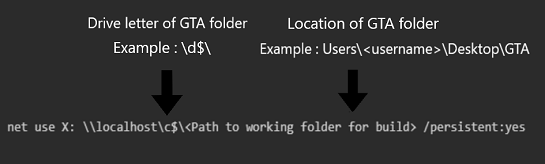

# DO NOT USE ONLY FOR FIXING 

<h1 align="left"> 📜 The Ultimate GTA V Source Code Build Guide </h1>


## What purpose does this guide serve, and why does it exist  

This guide explains how to build GTA V (binaries, scripts, shaders) using the leaked source code #L189

It covers all the steps from these two guides and improves each one, aiming to be the only guide you need.

It also simplifies the process and explains it so that everyone can understand.

## Prerequisites

### Base
- For Building : `Windows 10 LTSC 2021` (Use in an Virtual Machine)

- For Running the game : Any Version of `Windows 10/11` (Not in a VM)

- Latest Grand Theft Auto V Files from Steam, Epic Games or Rockstar Games Launcher.

- Minimum 140-160GB of free Space, is Recommended because of the game files and programs.

- `GTAVSP.7z` - Source Code
     - Archive Password: `Mi76#b>9mRed`
     - You can verify the authenticity of the file by its SHA1 hash: `ca39323730ed644fa534a2946506d4287f92a799`
     - To verify with 7-Zip, right click the file and select 7-Zip > CRC SHA > SHA1
     - The Source code is not included in my Recource Archive you have to get it on you own download link can be found in [here](#download-links-for-source-code)
 
### Prebuilds and Resources     
- `update.rpf` and `update2.rpf` from GTA V build 2699
     - With prebuild scripts
     - Without prebuild scripts

- Prebuild Shaders

### All the Tools and Files that are mentioned on this guide are in the [Resources Archive](<BLANK>).

## Tools and Preparations on the Virtual Machine    
### Deactivate Anti Virus
  - You should deactive your anti-virus protection before doing any of the steps.
### Run the Toolset Auto Installer

   1. In Visual Studio 2012 
           - At `Optional features to install:` only select `Microsoft Foundation Classes for C++`

   2. In DirectX SDK (June 2010)
           - If you get error S1023, Uninstall Visual C++ 2010 Redistributable & Reinstall DirectX SDK - (June 2010)

   3. In IncrediBuild 4 
           - At `Component Selection` Only select `IncrediBuild Agent` and `IncrediBuild Coordinator`
           - For all the ohter steps just press next 
  
   4. In Microsoft DirectX SDK (June 2010) 
           - At `Help Improve the DirectX SDK` select `No, I would not like to participate`

   5. In Git
           - Dont change any settings

### Create X:\ Drive

   1. Create a new folder called `GTA` to the Desktop or anywhere that you want.
       - The `GTA` folder does have to be on the `C:\` Drive

   2. Open Command Prompt (not as administrator)

   3. Run this 
        - Make sure to replace `<Path to working folder for build>` 
        - If your folder in not located on the `C:\` Drive Replace c$ with the right Drive letter 
```
net use X: \\localhost\c$\<Path to working folder for build> /persistent:yes
```

Example:



   1. Create the folder `X:\gta5` and copy all folders from `GTAVSP.7z\GTA V Source` into it the drive then should look like this:

```
🖥️ X:
 ┗ 📂 gta5
 ┃ ┣ 📂 src
 ┃ ┣ 📂 script
 ┃ ┗ 📂 tools_ng
 ```

   6. Right click the folder X:\gta5, select `Properties`, uncheck `Read-only`, click Apply then OK

   7. Now Reboot the VM or your system to ensure the changes are finalized

## With patches to use?

At this point you have to decide what patch you want to use, there are 3 to choose from

### 1. Basic Patches: 
  - Basic Patches fixes a lot of issues when builing the binarys and fixes a lot of dev_tools.
  - Does not need X Drive on main system if you dont want to use the rag (still recommended to use)

### 2. Retail Patches: 
  - Makes the game act more like retail version of the game. (will likely be used for the GTA Online Private servers (Still in WIP))
  - Needs Git installed on your main system
  - Needs a X Drive on the main system

### 3. Combined Patches: 
  - Trys to combine the dev_tool and building fixes from Basic Patches with the attempt to make the game act more like a retail version
  - Needs Git installed on your main system
  - Needs a X Drive on the main system 

### ❗ You cant combine them, and every single one of them works perfectly fine on its own ❗

To get a better description on what with patch does go [here](ReadMe-Files/Patch-Explanation.md).


## 1. Basic Patches 

### ❗ Do not combine with it any ohter patches like Combined or Retail Patches ❗ 
 
### In the Virtual Machine

### Patch The X: Drive 

  1. Open the `1. Patch X drive` folder 

  2. Run `Patch X Drive.bat` as Administrator 

### Patching the Source code

  1. Open the `Basic Patcher` folder and copy the `gta5` and the `3rdParty` folder to the X:/ drive 

  2. This is how the X Drive should look then:
     
```
🖥️ X:
 ┣ 📂 3rdParty
 ┗ 📂 gta5
 ┃ ┣ 📂 src
 ┃ ┃ ┣ 📂 dev_ng
 ┃ ┣ 📂 script
 ┃ ┃ ┣ 📂 dev_ng 
 ┃ ┗ 📂 tools_ng
```
## 2. Retail Patches

#### ❗ Do not combine with any ohter patches like Combined or Basic Patches ❗

### In the Virtual Machine


## Builing Game Binary

1. Run `X:\gta5\src\dev_ng\game\VS_Project\load_sln_unity_2012.bat` 
	- If prompted with `How do you want to open this file?`, check `Always use this app to open .sln files` and Select `Visual Studio 2012` then click OK
        - A warning will show in the Command Prompt Window stating your	missing	an SDK, please ignore it and press any key to continue and open it with	Visual	Studio	2012.
        - If your promted with `Choose Default Environment Settings` Select `General Development Settings` and at `Local Help Documentation` select `None`

2. Once the solution loads, open the dropdown menu that says `Debug` at the top, select `Configuration Manager`

3. Change `Active Solution Platform` to `x64` and close the configuration window

4. Hold Ctrl key and click all projects under `GameLibs`, `Rage` and `game` folder, right-click and select `Properties`

5. In the `Configuration` dropdown, select `All Configurations`

6. Select `C/C++ > All options`, under `Look for options or switches`, search `err` and set `Treat Warnings as Errors` to `No (/WX-)`, then click `Apply` and `OK`
   - For faster compiles, search `mul` and set `Multiprocessor Compilation` to `Yes (/MP)`
      - If you get the error `C1060: Compiler is out of heap space` during build, come back to the above setting and turn it off
7. Right-click the `game` project and select `Properties` and do step 5,6 again
8. Change build the type at the top of the window from `Debug` to `BankRelease`
   - This Step is optional, you can build the game in `Debug` too but you will lost alot of performance
10. At the top of the window, select `Build > Build Solution` and wait for build to finish
11. Copy output binary to game folder.

### If you are confused, Watch this:

https://github.com/GTA-Source-Helpe/Ultimate-GTA5-Source-code-Guide-BETA/assets/146978592/20f24012-0a5e-4ca4-b65e-985770486c09
<video src="/ReadMe-Files/Build-game-binarys.mp4" width="870" height="540" controls></video>

### Building Shaders
Shaders are required for the game to load (obviously), so in order to get them working we must build them, to do so:

1. Open `X:\gta5\src\dev_ng\game\VS_Project\load_sln_unity_2012.bat` - A warning will show in the Command Prompt Window stating your missing an SDK, please ignore it and press any key to continue and open it with Visual Studio 2012.
2. After you’ve opened the project in Visual Studio 2012, At the top change from `Debug` to `BankRelease` and from `Durango` to `x64`, Select all the projects, except the projects in `PSC & Shaders`. Right Click on one of them and go to `Properties —> C/C++ —> General`, Find: `Treat Warnings As Errors`, and set it to `No /WX-` and then find `Multi-Processor Compilation` and set that to `Yes /MP`. This will speed up the time it takes to build the solution since it’ll be taking advantage of the Processor and will ignore all the Warnings which is what we expect to occur.
3. Next, your going to find `shaders_rc`, Select it in Visual Studio, Right Click it and press `Rebuild`. This will begin rebuilding your Shaders in IncrediBuild.
4. To see the progress and watch its status, in the taskbar, open the Overflow Menu (The Lil ^ in the taskbar on the right) Find `IncrediBuild Agent` (The one with a Green Arrow), Right Click it and press `Build Monitor`. In Build Monitor, on the left press the icon at the top that should say `Progress`. You should now see what your building and in the bottom left of the window will be a percentage of how complete it is out of 100%
5. Once the shaders are built close Visual Studio 2012 and proceed to the next steps.

# Download Links for Source Code

### Links
1. **Cyberfile:** https://cyberfile.me/7bu8
2. **Google Drive:** https://drive.google.com/file/d/1EY7VpufZeuwEAUkWSekpu-9u83GuAt3K/view
3. **OneDrive:** https://1drv.ms/u/s!AsVmj7BukgyGa6N9kb-IwgHhcmQ?e=eFBzvB


### Torrent Magnets
```
magnet:?xt=urn:btih:0e1610f5c681bbe8e908ddb7f73dc890899994f4&dn=gta%20v%20source%20code&tr=udp%3a%2f%2ftracker.opentrackr.org%3a1337%2fannounce

Backup: 

magnet:?xt=urn:btih:BYLBB5OGQG56R2II3W37OPOISCEZTFHU
```
I recommend to use [Free Donwload Manager](https://www.freedownloadmanager.org/en/) to download the torrent  


## 🌟 Credits 

### The two guides that this guide is based on 
1: [📜 GTA V Source Code Build Guide](https://github.com/P0L3NARUBA/gtav-sourcecode-build-guide)

2: [→ GTA V - Full Build Guide ←](https://rentry.co/build-gtav)

### General help with the guide

[@yungDoom](https://github.com/yungDoom)

[OceanView Discord](https://discord.gg/hkGFqefFJm)

### OneDrive Link for Source Code

[@RockstarAdvancedGameEngine](<https://github.com/RockstarAdvancedGameEngine>)

### Torrent and Cyberfile Link for Source Code

[Exetools Forums](<https://forum.exetools.com/showthread.php?t=20799>) 
